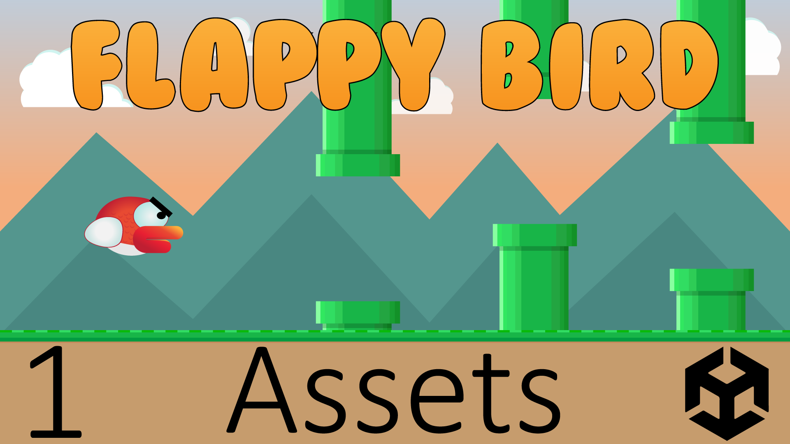

# Flappy Bird (2D)

Lerne den Mobile Game Hit Flappy Bird aus dem Jahr 2013 zu entwickeln! Flappy Bird wurde von dem vietnamesischen Spieleentwickler Dong Nguyen entwickelt. Das Spiel ist ein endloser Side-Scroller, in dem der Spieler einen Vogel steuert und versucht diesen durch grüne Rohre zu navigieren, ohne diese zu treffen.

- Schwierigkeitsgrad: Anfänger
- Themen: Side-Scroller Game , Unendlich Objekte generieren 
- Version: 2020.3.26f1
- [🧰 Assets Download](https://github.com/PrezipGames/Breakout/raw/main/BreakoutPackage.unitypackage)
- [🎮 Downloade das ganze Projekt](https://github.com/PrezipGames/Breakout/archive/refs/heads/main.zip)
- [🎬 YT Tutorial](https://www.youtube.com/watch?v=MTn1LDzZnro&list=PL5ilq2JHX8N79tlLb5BinxmdcLz9ML1qJ)
- [💬 Joint unserem Discord Server](https://discord.gg/kusy4JQ4)
- [👍 Abonniert um keine Videos zu verpassen](https://www.youtube.com/@prezipgames)

## Viel Spaß beim Entwickeln!
