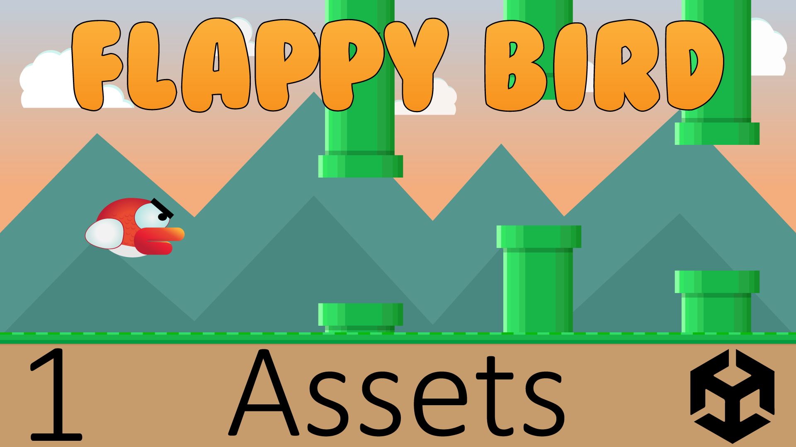

Hallo Zusammen,

in dieser Videoreihe entwickeln wir das Spiel Flappy Bird in Unity. Das ganze wird ein bisschen komplizierter als die Breakout-Reihe, eignet sich aber immernoch sehr gut für Einsteiger!

- [YouTube](https://www.youtube.com/watch?v=R-QhOwWX3jU)

Viel Spaß bei den Videos!
